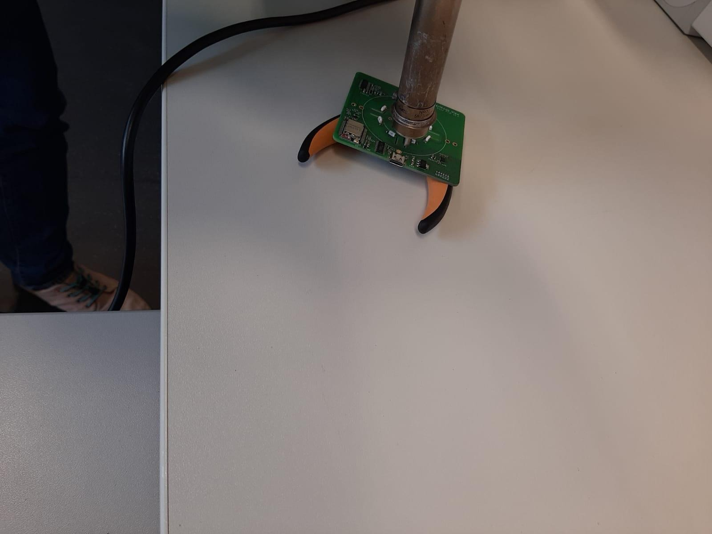

# DREA

Das Ziel des Forschungs- und Entwicklungsvorhabens »DREA« ist die Entwicklung eines innovativen haptischen Drehcontrollers, welcher 
für die Nutzung multifunktionaler Systeme genutzt werden kann. In aussicht steht diesen Drehcontroller mit einer Giff- und Gestensteuerung zu versehen,
um damit eine große Anzahl von Funktionen auf verschiedenen Geräten zu ermöglichen. Die idee liegt darin, dass beispielsweise mit drei Fingern die
Lautstärke reguliert und mit vier Fingern die Anwendung gewechselt werden kann. 
Ebenso soll der Drehcontroller über haptisches Feedback verfügen, damit eine intuitive bzw. barrierefreie nutzung möglich wird. 
Somit besteht der erste Meilenstein darin, die Konzeption sowie der Prototypenentwicklung als auch der Evaluation des Drehcontrollers auf Basis
von integrierter Elektronik und Software. Zweiteres wird im zweiten Meilenstein kontinuierlich weiterentwickelt und hat die Zielsetzung intelligentes verhalten
in die Software zu integrieren, sodass diese vom Nutzerverhalten lernt. 
Der Forschungsbereich fokussiert sich hierbei auf die Erforschung einer entsprechenden Sensorik, Aktuatorik und die Prototypisierung der Funktionalität in Hardware und Software.  

Zur Realisierung der oben genannten Punkte wird hier auf ein bereits bestehendes Projekt zurückgegriffen, welches sich bereits mit dem
Design sowie der Konstruktion passender Hardwarekomponenten auseinandergesetzt hat. Deshalb orientiert sich das Projekt zunächst für den ersten Meilenstein
am nachbau des von [scottbez1](https://github.com/scottbez1) entwickelten [Smartknob](https://github.com/scottbez1/smartknob) Projekts.
Dies stellt sowohl eine übersicht über Design, Hardware und auch eine experimentelle Version von Software zur verfügung, welche
zur Hardwaresteuerung genutzt wird.

**_Hinweis:_** Sowohl Design des Controllers als auch die Software können/werden sich im Laufe des Projekts verändern, um 
die oben beschriebe Zielsetzung erfüllen zu können.

## Projektaufbau

Das Projekt gliedert sich in folgende Schritte:

1. Ermittlung & Dokumentation der elektronischen Komponenten, welche für das Projekt nötig sind.
2. Rekonstruktion der Leiterplatine und deren Herstellung.
3. Ermittelung und ggf. Anpassung der benötigten 3D-Bauteile.
4. Druck der Bauteile.
5. Assemblieren der elektronischen Komponenten auf der Platine.
6. Aufspielen der Software.

Der haptische Controller sieht anschließend wie folgt aus:

[source](https://github.com/scottbez1/smartknob/blob/master/doc/img/explodedv145.gif)

## Ermittlung & Dokumentation

Da das Referenzprojekt bereits eine Liste der benötigten Komponenten zur verfügung stellt, wird hier darauf verweisen.

### Base PCB:

https://smartknob-artifacts.s3.us-west-1.amazonaws.com/master/electronics/view_base-ibom.html

Hinweis:

Da einige Bauteile u.a. auch der Motor nicht mehr hergestellt werden bzw. eine sehr hohe wartezeit bei der Bestellung mit sich bringen,
wurde hier auf ähnliche Bauteile ausgewichen.

Ausweichbauteile:
1. Drucksensoren: https://de.aliexpress.com/item/4000204288561.html?gatewayAdapt=glo2deu
2. Mineralglas: https://de.aliexpress.com/item/33055356489.html?gatewayAdapt=glo2deu
3. Display: https://de.aliexpress.com/item/1005001321857930.html?gatewayAdapt=glo2deu
4. USB Controller: https://www.lcsc.com/product-detail/USB-ICs_WCH-Jiangsu-Qin-Heng-CH340C_C84681.html
5. ESP32: https://de.aliexpress.com/item/1005002308952882.html?gatewayAdapt=glo2deu
6. Motor: https://m.de.aliexpress.com/item/1005001968864724.html?spm=a2g0o.order_list.0.0.59c45c5fUXIEbl&gatewayAdapt=Pc2Msite
### Screen View:

https://smartknob-artifacts.s3.us-west-1.amazonaws.com/master/electronics/view_screen-ibom.html

## Platinenrekonstruktion

### Platinendesign Base PCB:

 

### Platinendesign Screen View PCB:

 

Die Platinen wurden ursprünglich mit dem Designwerkzeug [Altium Designer](https://www.altium.com/de) konstruiert und wie folgt beschrieben in gerber Dateien exportiert.

Der Altium Designer zerlegt die Platine in verschiedene schichten bzw. "Schichtdateien", somit müssen diese in der endsprechenden Kennzeichnung
wieder zusammengeführt werden.

### PCB schichten:

Sowohl bei der Screen View als auch bei der Base View werden die gleichen Bezeichnungen benutzt.
Zur identifikation der einzelnen schichten sind diese hier einmal aufgelistet:

- Top Copper: *.GTL
- Top Solder Mask: *.GTS
- Top Silkscreen: *.GTO
- Bottom copper: *.GBL
- Bottom Solder Mask: *.GBS
- Bottom Silkscreen: *.GBO
- Mechanical: *.GKO
- Drill Layer: *.drl
- Edge Cuts: *.gm1

_**Wichtig:**_ 

Im Altium Designer muss der Drill Layer gesondert eingegeben werden! 

Wenn die Schichten importiert und zugeordnet wurden, kann diese Datei im PcbDoc Format exportiert werden.
Da sich diese mit der Version von Altium ändern können, wird hier auf die Dokumentation von Altium verlinkt:
[Altium Dokumentation](https://www.altium.com/documentation/knowledge-base/altium-designer/gerber-to-pcb)

Diese Datei kann dann zur fertigung bei einem Hersteller genutzt werden. 
Für dieses Projekt wurde die Platine extern beim Hersteller [Beta Layout GmbH](https://de.beta-layout.com/leiterplatten/) 
hergestellt.

## Anpassung der 3D-Bauteile

Da dieses Projekt einen Alternativen Motor für den haptischen Controller nutzt, müssen seitens der 3D-Bauteile 
änderungen vorgenommen werden. 
Um dies zu erreichen, wurde zum Editieren der Bauteile, das open source Tool [Blender](https://www.blender.org/) genutzt.
Hiermit wurden u.a. die Löcher für die Schrauben entfernt & das Bauteil skaliert.
Außerdem wurde das Tool [FreeCAD](https://www.freecadweb.org/) genutzt, um benötigte löcher wieder hinzuzufügen.

Anschließend wurden die 3D-Modelle gedruckt, verwendet wurde herkömmlicher Kunststoff & Metall für die MountBase.

Übersicht [3D-Bauteile](https://bezeklabs.autodesk360.com/g/shares/SH35dfcQT936092f0e4372570ef992887b79)

## Assemblieren der elektronischen Komponenten

Die elektronischen Kleinbauteile sind aufgrund ihrer größe nur schwer per hand zu verlöten. Aus diesem Grund haben wir uns
dazu entschieden die Bauteile mittels einer Vakuumpipette auf die jeweiligen Kontakte zu legen und diese anschließen mittels eines
Lötofens zu fixen. Da dies jedoch nicht für alle Bauteile möglich/nötig war, wurden die Kontaktstellen wie z.B. den USB-Anschluss
und die Kontaktstellen des Displays mit der Hand verlötet. Dies ist im folgenden noch einmal dargestellt.

  
Verlöten der Bauteile: 

 
 
 
  
 

## Aufspielen der Software

Für die Funktionalität des Controllers ist neben der Hardware auch Software zur Steuerung dieser nötig. 
Hierfür liefert das Referenzprojekt bereits eine Lauffähige version von C++ code mit und wird auch für die Inbetriebnahme
des Controllers genutzt. 
Jedoch bedarf es hierfür einer entsprechend dafür ausgelegten Bibliothek, welche ein auf die Hardware zugeschnittenes interface
zur verfügung stellt. Aus diesem Grund wird die frei verfügbare und auch im Referenzprojekt genutzten Bibliothek [PlatformIO](https://platformio.org/) zur ansteuerung der 
Hardware genutzt. Diese befinden sich im ordner lib.
Im Ordner src befinden sich alle nötigen Dateien zur Ansteuerung der Hardware.

Für den Prototypen werden hier keine Änderungen am Code vorgenommen, sondern dieser lediglich kompiliert und über die USB Schnittstelle
aufgespielt.

_**Hinweis:_** Für nachfolgende Projekte kann sich der Code ändern, da ursprünglich geplant war den Controller Softwareseitig weiterzuentwickeln.

## Reflextion des Projekts

Die Durchführung des rekonstruierens den Prototypen war ein voller Erfolg trotz der fehlenden Bauteile,
welche eigentlich für die Durchführung nötig waren. Diese ließen sich nämlich mit Alternativen austauschen ohne, dass es
Probleme mit der bereit gestellten Firmware gab.
Außerdem funktionierte der zusammengebaute Prototyp schon nach dem Aufspielen der Software.
Jedoch ist sollte ebenfalls genannt werden, dass komplikationen mit dem Design der 3D Modele hinsichtlich des Zusammenbaus gab, welche sich
unter anderem dadurch äußerten, dass sich das Bauteil zur Befestigung der Screen View nur schwer mit der Mount Base zusammenbauen ließ.
Ebenfalls hat sich herausgestellt, dass sich für die Mount Base kein einfacher Kunststoff eignet, da dieser allein unter der Belastung der Montage zerbrochen ist.
Eine bessere Alternative ist in diesem Fall eine Mount Base aus Epoxidharz.
Für den weiteren Verlauf des Projekts wäre zum Empfehlen, dass weitere anpassungen an elektronischen Komponenten von der Seite der technischen Informatik bzw. der Elektrotechnik
vorgenommen wird, da für weitere Anpassung an der Haptik die Komplexität der Hardware verstanden werden muss. Die Aspekte zur intelligenten steuerung des Controllers durch
Künstliche Intelligenz kann jedoch, weiterhin von der Informatik übernommen werden.