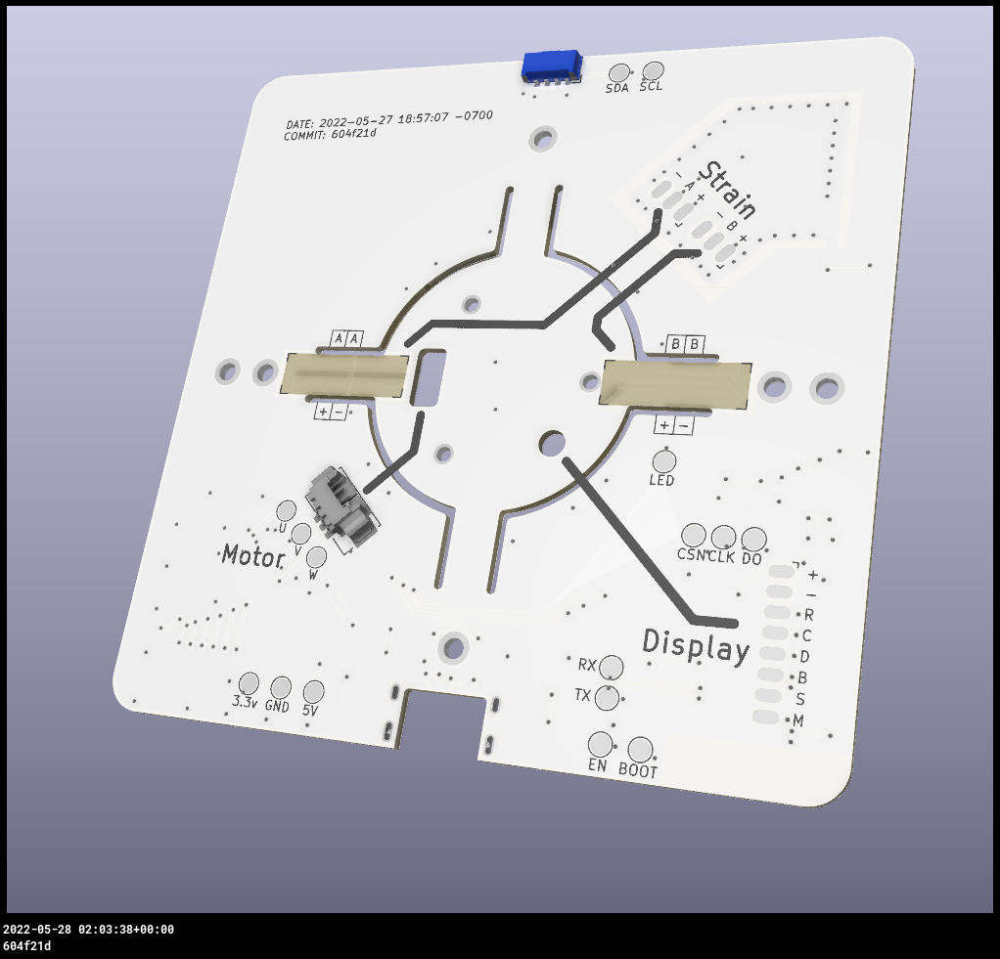

# DREA

Das Projekt DREA zielt darauf ab, einen haptischen Drehcontroller zu bauen.
Der Fokus des Projekts liegt hierbei auf dem Rekonstruieren eines bereits existierenden Prototypen 
[Smartknob](https://github.com/scottbez1/smartknob) von [scottbez1](https://github.com/scottbez1), welcher bereits einige Funktionen unterstützt.

## Projektaufbau

Das Projekt gliedert sich in folgende Schritte:

1. Ermittlung & Dokumentation der elektronischen Komponenten, welche für das Projekt nötig sind.
2. Rekonstruktion der Leiterplatine und deren Herstellung.
3. Ermittelung und ggf. Anpassung der benötigten 3D-Bauteile.
4. Druck der Bauteile.
5. Assemblieren der elektronischen Komponenten auf der Platine.
6. Testen der Elektronik auf korrekte funktion.
7. Zusammenbau der 3D-Bauteile und der elektronischen Komponenten.
8. Aufspielen der Software.

Der haptische Controller sieht anschließend wie folgt aus:

## Ermittlung & Dokumentation

Da das Referenzprojekt bereits eine Liste der benötigten Komponenten zur verfügung stellt, wird hier darauf verweisen.

### Base PCB:

https://smartknob-artifacts.s3.us-west-1.amazonaws.com/master/electronics/view_base-ibom.html

Hinweis:

Da einige Bauteile u.a. auch der Motor nicht mehr hergestellt werden bzw. eine sehr hohe wartezeit bei der Bestellung mit sich bringen,
wurde hier auf ähnliche Bauteile ausgewichen.

Ausweichbauteile:
1. TODO Teil1 &#8594; Teil2

### Screen View:

https://smartknob-artifacts.s3.us-west-1.amazonaws.com/master/electronics/view_screen-ibom.html

## Platinenrekonstruktion

### Platinendesign Base PCB:

 

Die Platinen wurden ursprünglich mit dem Designwerkzeug [Altium Designer](https://www.altium.com/de) konstruiert und wie folgt beschrieben in gerber Dateien exportiert.

Der Altium Designer zerlegt die Platine in verschiedene schichten bzw. "Schichtdateien", somit müssen diese in der endsprechenden Kennzeichnung
wieder zusammengeführt werden.

### PCB schichten:

Sowohl bei der Screen View als auch bei der Base View werden die gleichen Bezeichnungen benutzt.
Zur identifikation der einzelnen schichten sind diese hier einmal aufgelistet:

- Top Copper: *.GTL
- Top Solder Mask: *.GTS
- Top Silkscreen: *.GTO
- Bottom copper: *.GBL
- Bottom Solder Mask: *.GBS
- Bottom Silkscreen: *.GBO
- Mechanical: *.GKO
- Drill Layer: *.drl
- Edge Cuts: *.gm1

_**Wichtig:**_ 

Im Altium Designer muss der Drill Layer gesondert eingegeben werden! 

Wenn die Schichten importiert und zugeordnet wurden, kann diese Datei im PcbDoc Format exportiert werden.
Da sich diese mit der Version von Altium ändern können, wird hier auf die Dokumentation von Altium verlinkt:
[Altium Dokumentation](https://www.altium.com/documentation/knowledge-base/altium-designer/gerber-to-pcb)

Diese Datei kann dann zur fertigung bei einem Hersteller genutzt werden. 
Für dieses Projekt wurde die Platine extern beim Hersteller [Beta Layout GmbH](https://de.beta-layout.com/leiterplatten/) 
hergestellt.