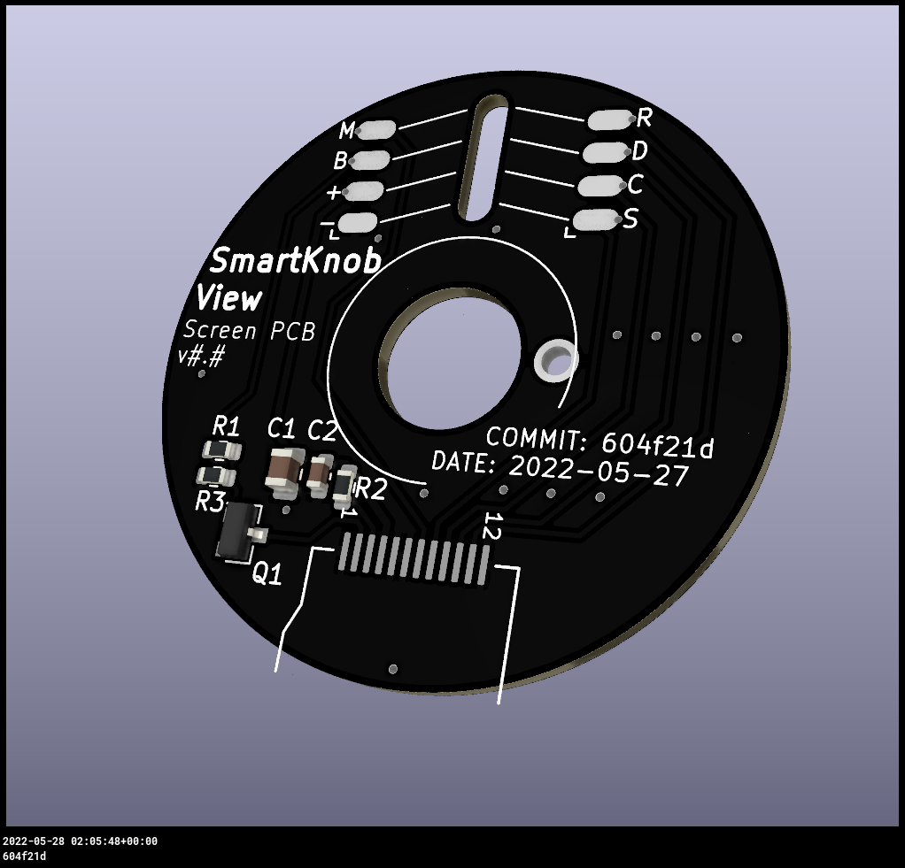
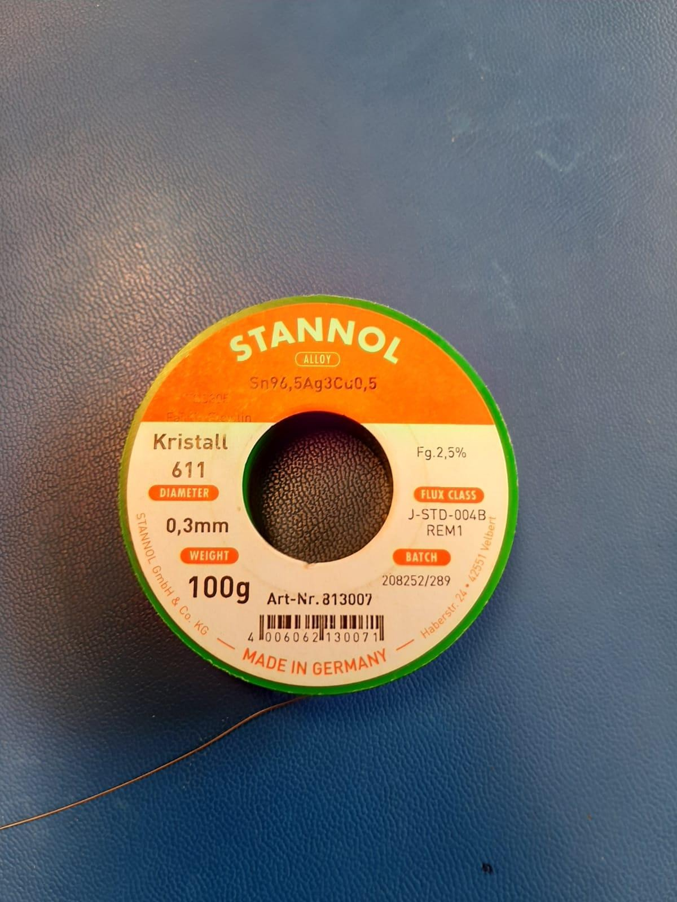
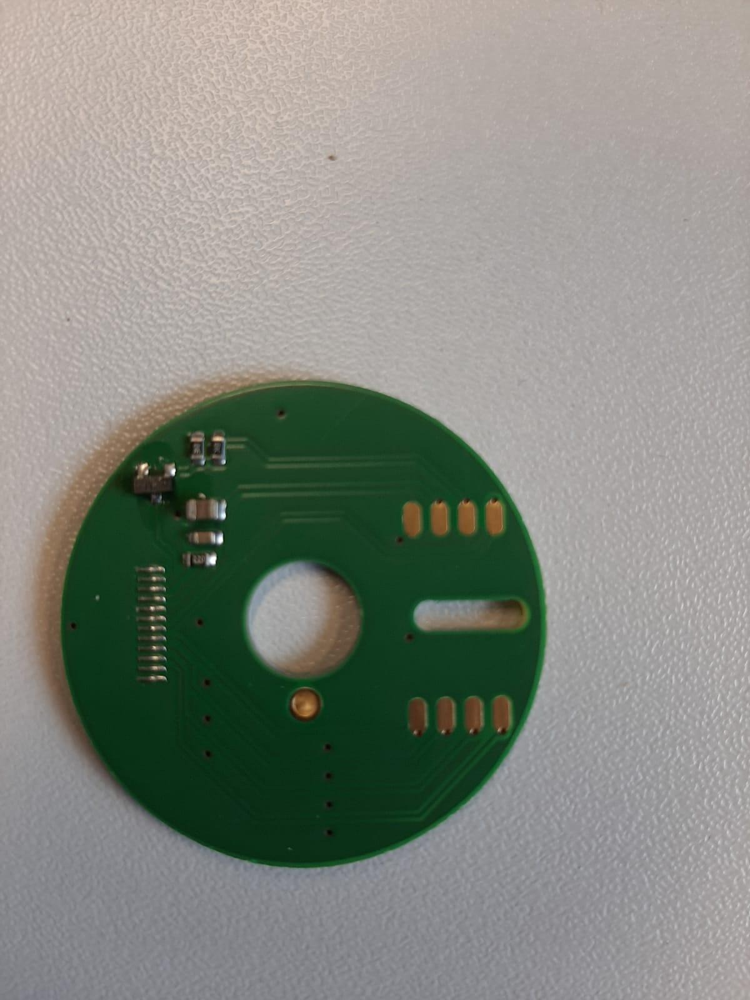

# DREA

Das Ziel des Forschungs- und Entwicklungsvorhabens »DREA« ist die Entwicklung eines innovativen haptischen Drehcontrollers, welcher 
für die Nutzung multifunktionaler Systeme genutzt werden kann. In Aussicht steht, diesen Drehcontroller mit einer Griff- und Gestensteuerung zu versehen,
um damit eine große Anzahl von Funktionen auf verschiedenen Geräten zu ermöglichen. Die Idee basiert darauf, dass beispielsweise mit drei Fingern die
Lautstärke reguliert und mit vier Fingern die Anwendung gewechselt werden kann. 
Ebenso soll der Drehcontroller über haptisches Feedback verfügen, damit eine intuitive bzw. barrierefreie Nutzung möglich wird. 
Somit besteht der erste Meilenstein in der Konzeption, sowie der Prototypentwicklung, als auch der Evaluation des Drehcontrollers auf Basis
von integrierter Elektronik und Software. Zweiteres wird im zweiten Meilenstein kontinuierlich weiterentwickelt und hat die Zielsetzung intelligentes verhalten
in die Software zu integrieren, sodass diese vom Nutzerverhalten lernt. 
Der Forschungsbereich fokussiert sich hierbei auf die Erforschung einer entsprechenden Sensorik, Aktuatorik und die Prototypisierung der Funktionalität in Hardware und Software.  

Zur Realisierung der oben genannten Punkte wird hier auf ein bereits bestehendes Projekt zurückgegriffen, welches sich bereits mit dem
Design sowie der Konstruktion passender Hardwarekomponenten auseinandergesetzt hat. Deshalb orientiert sich das Projekt zunächst für den ersten Meilenstein
am nachbau des von [scottbez1](https://github.com/scottbez1) entwickelten [Smartknob](https://github.com/scottbez1/smartknob) Projekts.
Dies stellt sowohl eine übersicht über Design und Hardware, wie auch eine experimentelle Version von Software zur Verfügung, welche
zur Hardwaresteuerung genutzt wird.

**_Hinweis:_** Sowohl Design des Controllers als auch die Software können/werden sich im Laufe des Projekts verändern, um 
die oben beschriebe Zielsetzung erfüllen zu können.

## Projektaufbau

Das Projekt gliedert sich in folgende Schritte:

1. Ermittlung & Dokumentation der benötigten elektronischen Komponenten.
2. Rekonstruktion der Leiterplatine und deren Herstellung.
3. Ermittelung und ggf. Anpassung der benötigten 3D-Bauteile.
4. Druck der Bauteile.
5. Assemblieren der elektronischen Komponenten auf der Platine.
6. Aufspielen der Software.

Der haptische Controller sieht anschließend wie folgt aus:

[source](https://github.com/scottbez1/smartknob/blob/master/doc/img/explodedv145.gif)

## Ermittlung & Dokumentation

Da das Referenzprojekt bereits eine Liste der benötigten Komponenten zur verfügung stellt, wird hier darauf verwiesen.

### Base PCB:

https://smartknob-artifacts.s3.us-west-1.amazonaws.com/master/electronics/view_base-ibom.html

Hinweis:

Da einige Bauteile u.a. auch der Motor nicht mehr hergestellt werden bzw. eine sehr hohe wartezeit bei der Bestellung mit sich bringen,
wurde hier auf ähnliche Bauteile ausgewichen.

Ausweichbauteile:
1. Mineralglas: https://de.aliexpress.com/item/33055356489.html?gatewayAdapt=glo2deu - unterschiedlicher Durchmesser
2. Bipolartransistor: [Alternative](https://www.mouser.de/ProductDetail/Nexperia/PMBT4403235?qs=LOCUfHb8d9vNp5NBUNhG6Q%3D%3D)  - [Original](https://www.lcsc.com/product-detail/Bipolar-Transistors-BJT_onsemi-MMBT4403LT1G_C78864.html)
3. Motor: [Alternative](https://m.de.aliexpress.com/item/1005001968864724.html?spm=a2g0o.order_list.0.0.59c45c5fUXIEbl&gatewayAdapt=Pc2Msite) - [Original](https://www.sparkfun.com/products/20441)
### Screen View:

https://smartknob-artifacts.s3.us-west-1.amazonaws.com/master/electronics/view_screen-ibom.html

## Platinenrekonstruktion

### Platinendesign Base PCB:

 

### Platinendesign Screen View PCB:

 

Die Platinen wurden ursprünglich mit dem Designwerkzeug [Altium Designer](https://www.altium.com/de) konstruiert und wie folgt beschrieben in gerber Dateien exportiert.

Der Altium Designer zerlegt die Platine in verschiedene Schichten bzw. "Schichtdateien", somit müssen diese in der entsprechenden Kennzeichnung
wieder zusammengeführt werden.

### PCB schichten:

Sowohl bei der Screen View, als auch der Base View werden die selben Bezeichnungen benutzt.
Die in den Platinen genutzten Schichten sind untenstehend aufgelistet:

- Top Copper: *.GTL
- Top Solder Mask: *.GTS
- Top Silkscreen: *.GTO
- Bottom copper: *.GBL
- Bottom Solder Mask: *.GBS
- Bottom Silkscreen: *.GBO
- Mechanical: *.GKO
- Drill Layer: *.drl
- Edge Cuts: *.gm1

_**Wichtig:**_ 

Im Altium Designer muss der Drill Layer gesondert eingegeben werden! 

Wenn die Schichten importiert und zugeordnet wurden, kann diese Datei im PcbDoc Format exportiert werden.
Da sich diese mit der Version von Altium ändern können, wird hier auf die Dokumentation von Altium verlinkt:
[Altium Dokumentation](https://www.altium.com/documentation/knowledge-base/altium-designer/gerber-to-pcb)

Diese Datei kann zur Fertigung bei einem Hersteller genutzt werden und wurde im Rahmen dieses Projekts bei [Beta Layout GmbH](https://de.beta-layout.com/leiterplatten/) 
hergestellt.

## Anpassung der 3D-Bauteile

Da dieses Projekt einen alternativen Motor für den haptischen Controller nutzt, müssen seitens der 3D-Bauteile 
Änderungen vorgenommen werden. 
Um dies zu erreichen, wurde zum Editieren der Bauteile, das open source Tool [Blender](https://www.blender.org/), sowie [Fusion360](https://www.autodesk.de/products/fusion-360/personal) genutzt.
Abgeändert wurden u.a. die Bohrlöcher, die Skalierung, sowie die Wandstärke des Rohres.
Die Anpassungen sind im Folgenden dargestellt.

    
 Anpassungen 

        
             

Anschließend wurden die 3D-Modelle gedruckt, verwendet wurde herkömmlicher Kunststoff & Kunstharz für die MountBase und Screen Platform.

Übersicht [3D-Bauteile](https://bezeklabs.autodesk360.com/g/shares/SH35dfcQT936092f0e4372570ef992887b79)

## Assemblieren der elektronischen Komponenten

Die elektronischen Kleinbauteile sind aufgrund ihrer größe nur schwer per hand zu verlöten. Aus diesem Grund wurden
die Bauteile mittels einer Vakuumpipette auf den jeweiligen Kontakten, welche zuvor mit Lotpaste versehen wurden, platziert und 
anschließend in einem Lötofen ausgehärtet. Da dies jedoch nicht für alle Bauteile möglich/nötig war, wurden die Kontaktstellen wie z.B. der USB-Anschluss
und die Kontaktstellen des Displays mit der Hand verlötet. Dies ist im folgenden noch einmal dargestellt.

  
Verlöten der Bauteile: 

 
 
 
  
 

Verlöten der Kabel: 

 
 
 

Zusammengesetz war es jedoch durch die Dicke der Kabel nicht möglich den "Rotorspacer" ohne weiteres zu montieren,
deshalb wurde die mount base mittels schauben ein wenig angehoben, um dies zu ermöglichen.

 Anhebung der mount base 

 

Zusammengebaut sieht das Projekt wie folgt aus:

## Aufspielen der Software

Für die Funktionalität des Controllers ist neben der Hardware auch Software zur Steuerung dieser nötig. 
Hierfür liefert das Referenzprojekt bereits eine lauffähige Version von C++ code mit und wird auch für die Inbetriebnahme
des Controllers genutzt. 
Jedoch bedarf es hierfür einer entsprechend dafür ausgelegten Bibliothek, welche ein auf die Hardware zugeschnittenes interface
zur verfügung stellt. Aus diesem Grund wird die frei verfügbare und auch im Referenzprojekt genutzten Bibliothek [PlatformIO](https://platformio.org/) zur Ansteuerung der 
Hardware genutzt; diese befinden sich im ordner lib.
Im Ordner src befinden sich alle nötigen Dateien zur Ansteuerung der Hardware.

Für den Prototypen werden hier keine Änderungen am Code vorgenommen, sondern dieser lediglich kompiliert und über die USB Schnittstelle
aufgespielt.

_**Hinweis:**_ Für nachfolgende Projekte kann sich der Code ändern, da ursprünglich geplant war den Controller Softwareseitig weiterzuentwickeln.

Aufgrund von Hardwareproblemen war es nicht möglich den USB-C Port mittels PlatformIO zu erkennen. Grund dafür war eine überspannung 
am USB-C Port, was darauf hindeutet, dass der USB-C Port eventuell defekt sein könnte, da bereits versucht wurde mit mehr Stromzufuhr die Überspannung 
auszugleichen.

## Reflexion des Projekts

Die Rekonstruktion des Prototypens war ein halber Erfolg trotz der fehlenden Bauteile,
welche eigentlich für die Durchführung nötig waren. Diese ließen sich nämlich mit Alternativen austauschen ohne, dass es
Probleme mit dem Stromkreis gab.
Dennoch funktionierte der zusammengebaute Prototyp nicht nach dem Aufspielen der Software, da dies durch eine überspannung am USB-C Port nicht möglich war.
Ebenfalls zu erwähnen sind die Komplikationen mit den vorgegebenen 3D- Modellen, welche sich dadurch äußerten, dass die Modelle spröde (zurückzuführen auf Design und Material)
und praktisch nicht ineinander zu befestigen waren.
Aus diesem Grund wurden die Modelle während des laufenden Projekts abgeändert, was Design und Material betrifft.
Für den weiteren Verlauf des Projekts ist zu empfehlen, dass weitere Anpassungen an elektronischen Komponenten von der Seite der technischen Informatik bzw. der Elektrotechnik
vorgenommen wird, da für weitere Anpassungen an der Haptik die Komplexität der Hardware die im normalen Informatikstudium erworbenen Fertigkeiten übersteigt.
Zu empfehlen ist hierfür, das Projekt auf zwei Gruppen aufzuteilen, wobei sich eine auf die Hardware und die andere auf die Software beschränkt, was vorraussichtlich
zu einer schnelleren Fertigung des Projekts führt. Zudem können technische Probleme schneller ausfindig gemacht und behoben werden und das Softwareteam kann sich vollkommen auf die Aspekte der 
intelligenten Steuerung mittels künstlicher Intelligenz fokussieren.

## Gelernte Fertigkeiten

Im Rahmen des Projekts wurden grundlegende Fertigkeiten des 3D-Modelings und des nachfolgenden Druckens erlernt,
welche auf weitere Projekte übertragen werden können. Zudem wurde sich angeeignet, elektronische Komponenten mit
Vakuumpipette und Lötofen, als auch per Hand mit Lötkolben und Lötzinn anzubringen. Des weiteren wurden verschiedenste
Bereiche der TH kennengelernt und erlernt, diese zu verknüpfen und ein Projekt dieser Größenordnung mit Hilfe dieser zu realisieren.
